# Task 4 — Network Intrusion Detection System Using Suricata and Wazuh

## 1. Introduction

This project implements a Network Intrusion Detection System (NIDS) using Suricata and Wazuh.

Suricata was configured to monitor network traffic and generate security alerts when suspicious or policy-related activity was detected. Wazuh was used to collect, analyse and display the Suricata alerts through its monitoring dashboard.

The implementation was carried out using an Ubuntu system running Suricata and a Kali Linux system running the Wazuh Manager and Wazuh Dashboard.

## 2. Objectives

The objectives of this task were to:

* Install and configure Suricata as a Network Intrusion Detection System.
* Configure and verify Suricata detection rules.
* Monitor network traffic using Suricata.
* Integrate Suricata logs with Wazuh.
* View and analyse Suricata alerts through Wazuh.
* * Configure and test Wazuh Active Response using the `host-deny` and `firewall-drop` commands.
* Create a visualization of Suricata alerts in the Wazuh Dashboard.
* Document the implementation and results.

## 3. Laboratory Environment

The laboratory environment consisted of:

* **Ubuntu:** Used to run Suricata and monitor network traffic.
* **Kali Linux:** Used to run the Wazuh Manager and Wazuh Dashboard.
* **Suricata:** Network Intrusion Detection System.
* **Wazuh:** Security monitoring, alert analysis and Active Response.
* **VirtualBox:** Used to host the virtual machines.

The general monitoring flow was:

```text
Network Traffic
      ↓
   Suricata
      ↓
Suricata EVE JSON Log
      ↓
     Wazuh
      ↓
Wazuh Manager
      ↓
Wazuh Dashboard
      ↓
Alert Monitoring / Active Response
```

## 4. Suricata Installation and Configuration

Suricata was installed and configured on the Ubuntu system as the Network Intrusion Detection System.

### 4.1 Suricata Installation Verification

The Suricata installation was verified using:

```bash
suricata --build-info
```

**Figure 1: Suricata Build Information**

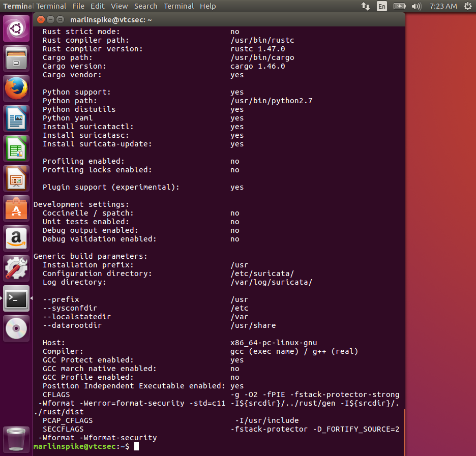

The command displayed the installed Suricata version and build information, confirming that Suricata was installed and available on the system.

### 4.2 Suricata Configuration Test

Before starting network monitoring, the Suricata configuration was tested to identify possible configuration errors.

```bash
sudo suricata -T
```
**Figure 6: Suricata Configuration Test Success**

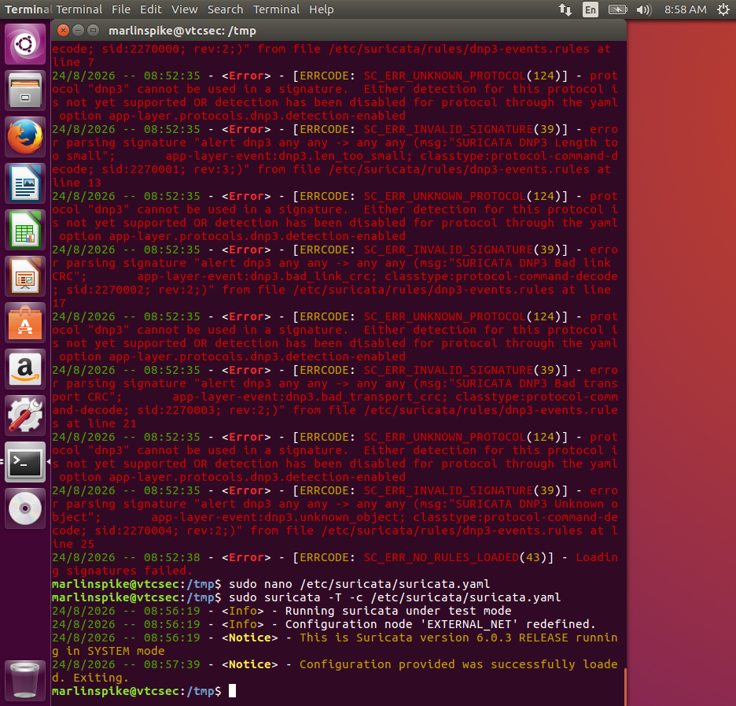

The configuration test completed successfully, confirming that the Suricata configuration was valid.

### 4.3 Suricata Rules

Suricata detection rules were configured and loaded for network traffic analysis.

The rules were checked to ensure that Suricata had the necessary signatures for detecting suspicious and policy-related network activity.

Suricata rules were successfully loaded and used during monitoring.**Figure 2: Suricata Rules Installed**

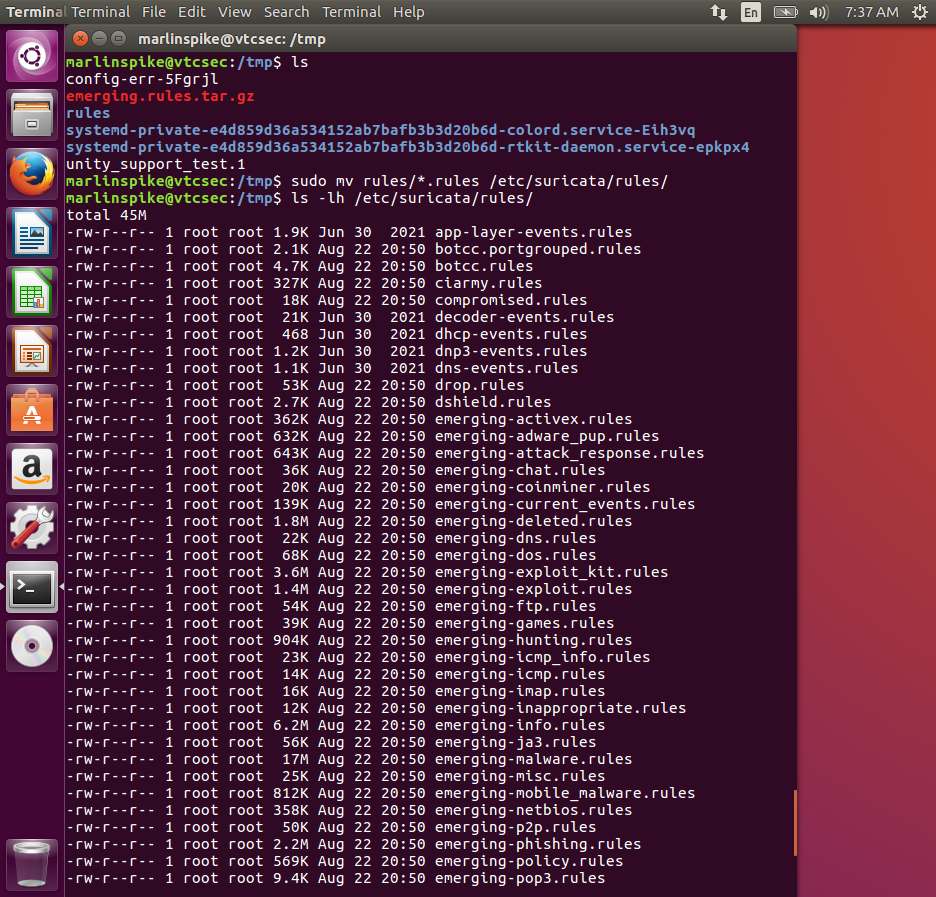


## 5. Suricata Monitoring

Suricata was started as a service and used to continuously monitor network traffic.

The status of the Suricata service was checked using:

```bash
sudo systemctl status suricata
```
**Figure 7: Suricata Service Running**

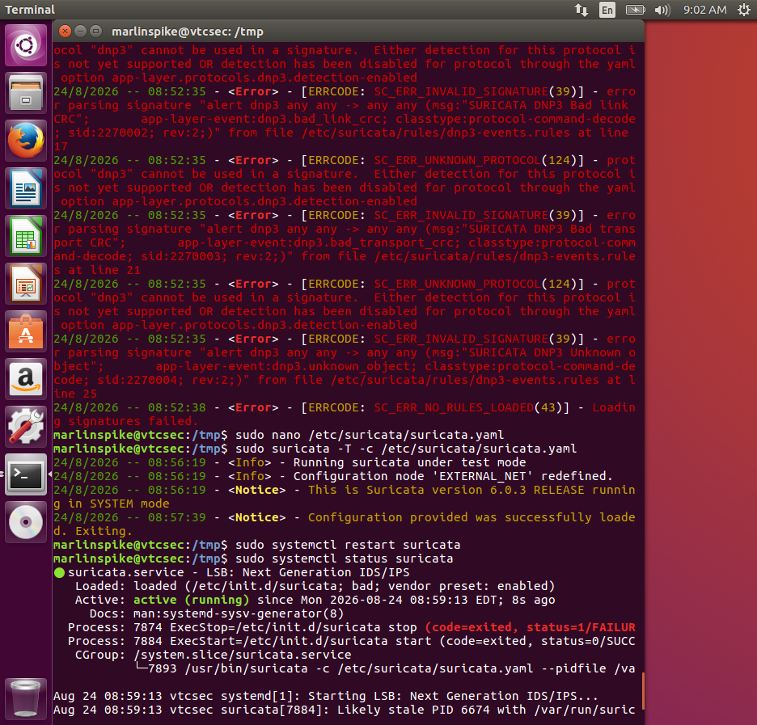
The service was confirmed to be active and running.

Suricata generated security events which were written to its EVE JSON log:

```text
/var/log/suricata/eve.json
```

The EVE JSON log provided the event data that was subsequently monitored by Wazuh.

## 6. Wazuh Integration

Wazuh was used to collect and analyse the Suricata events generated by the Ubuntu system.

The Suricata EVE JSON log was configured as a log source for Wazuh so that Suricata events could be processed by the Wazuh Manager.

The Wazuh Manager was confirmed to be active and running.

The Suricata events were subsequently visible in the Wazuh environment, confirming that the Suricata data was being received and analysed.

**Figure 8: Wazuh Server Services Running**

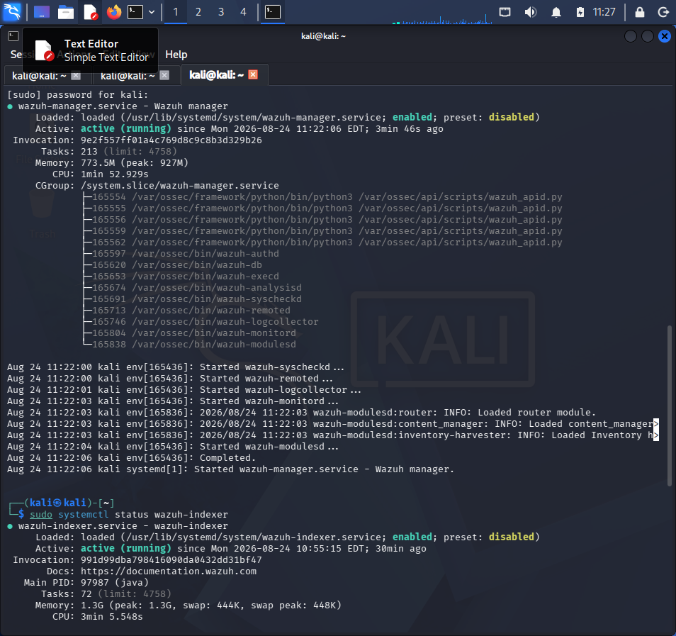

**Figure 10: Wazuh Agent Running**

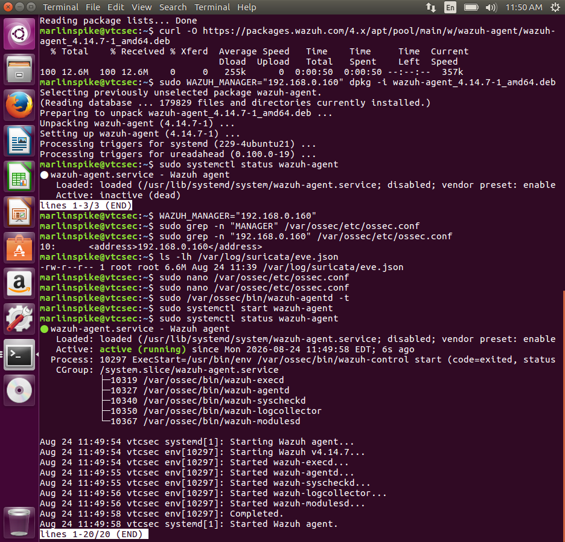**Figure 11: Ubuntu Agent Active in Wazuh**

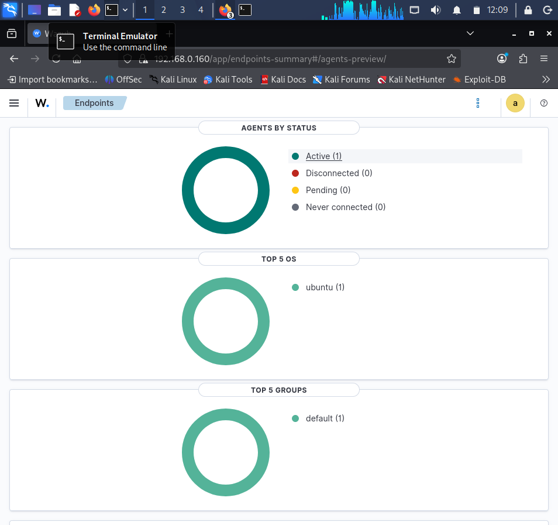


## 7. Suricata Alerts in Wazuh

After the Suricata and Wazuh integration was established, Suricata alerts were observed in the Wazuh logs and dashboard.

One of the observed Suricata events was:

```text
Rule ID: 86601
Level: 3
Description: Suricata: Alert - ET POLICY Possible Kali Linux hostname in DHCP Request Packet
```
**Figure 12: Suricata Alert Events**

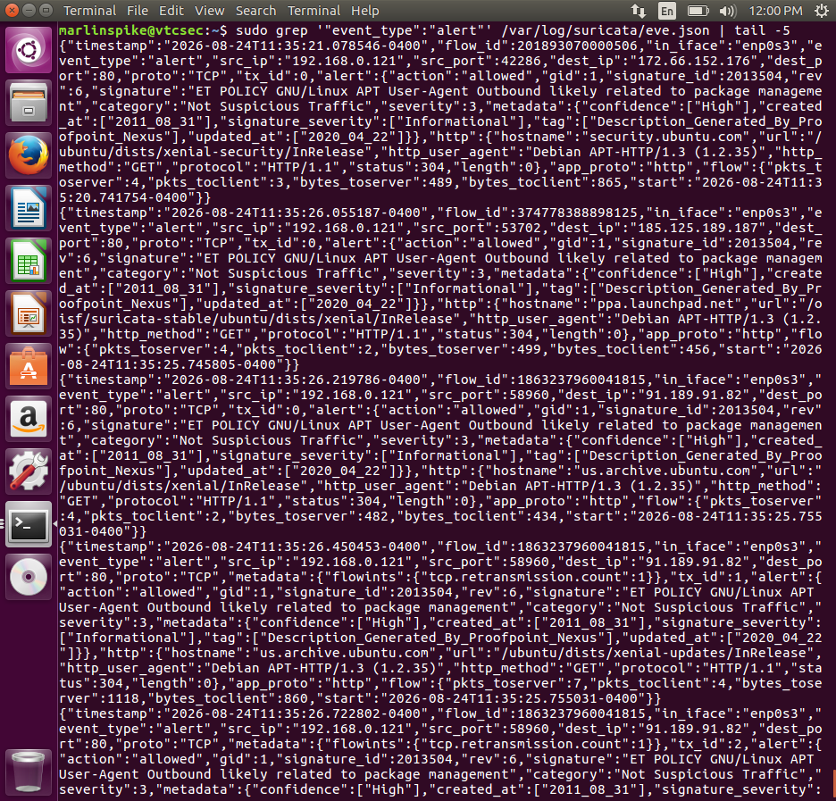

This demonstrated that Suricata was generating security events and that Wazuh was receiving and analysing those events.

The Suricata entries were also identified in the Wazuh alert logs.

**Figure 13: Wazuh Suricata Events**

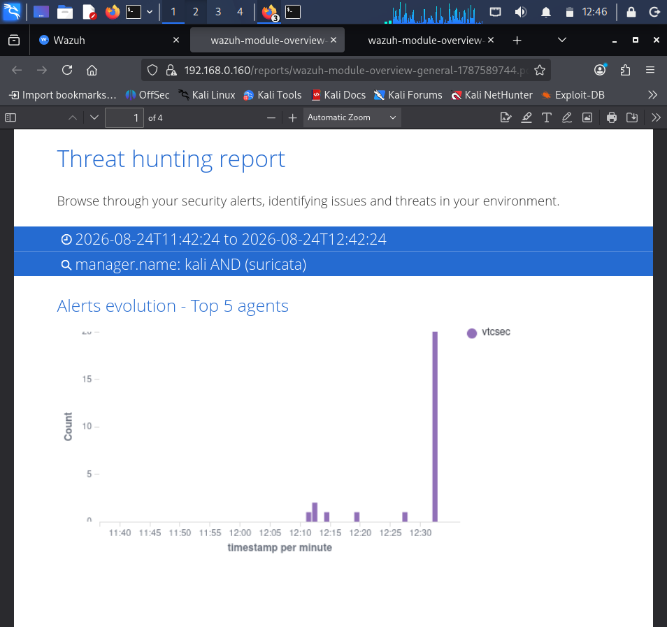

## 8. Wazuh Active Response Configuration

Wazuh Active Response was configured to automatically respond to detected security events using the `firewall-drop` command.

The configuration used was:

```xml
<!-- Define the firewall-drop command -->
<command>
  <name>firewall-drop</name>
  <executable>firewall-drop</executable>
  <expect>srcip,data.src_ip</expect>
  <timeout_allowed>yes</timeout_allowed>
</command>

<!-- Trigger firewall blocking on Suricata alerts -->
<active-response>
  <command>firewall-drop</command>
  <location>local</location>
  <rules_id>86601</rules_id>
  <timeout>600</timeout>
</active-response>
```
**Figure 17: Active Response Configuration**

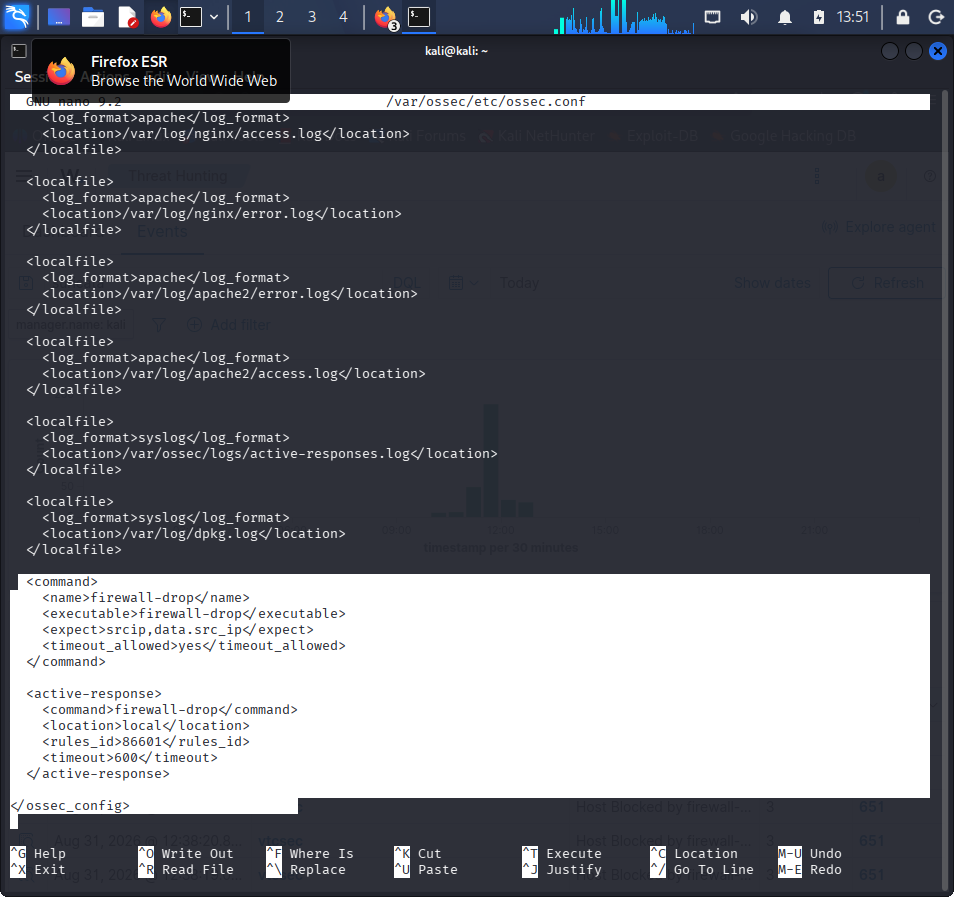

This configuration enables Wazuh Active Response to automatically execute
firewall-drop when Suricata rule 86601 generates an alert. The source IP
associated with the alert is passed to the firewall-drop command and blocked
for 600 seconds.

## 8.1 Wazuh Active Response Verification

After configuring Wazuh Active Response, a Suricata alert matching rule ID `86601` was generated. Wazuh processed the alert and triggered the configured `firewall-drop` response.

The Wazuh dashboard was then checked to confirm that the Suricata alerts were being received and visualized successfully. Screenshots of the Active Response configuration and Wazuh dashboard visualization are included in the `screenshots` directory as evidence of the completed implementation.

**Figure 18: Active Response Verification**

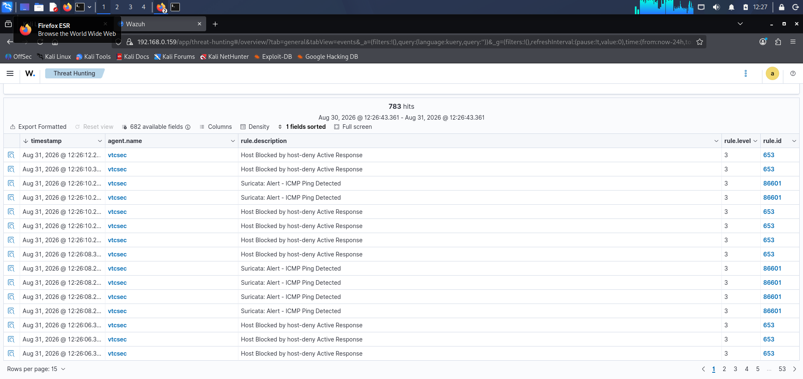


**Figure 19: Firewall Verification**

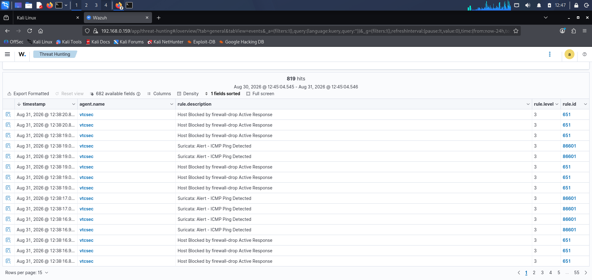


# 9. Wazuh Manager Verification

After making the configuration changes, the Wazuh Manager was checked to ensure that it remained active.

The manager was successfully running after the configuration was applied.

Wazuh logs were also checked during troubleshooting and verification.

Suricata-related entries were observed in the Wazuh logs, confirming that Suricata events were reaching the Wazuh monitoring environment.

 # 10. Network Monitoring and Alert Visualization

Suricata was monitored while network traffic was being generated. Suricata events were collected and forwarded to Wazuh for analysis.

The Wazuh dashboard was used to visualize Suricata alert activity and confirm that events were being received and displayed.


## 11. Suricata Alert Visualization

A line visualization was created in the Wazuh Dashboard to display the number of alerts over time.

The visualization was configured using:

* **Data source:** Wazuh Alerts
* **Metric:** Count
* **X-axis:** Date histogram
* **Time field:** `@timestamp`
* **Minimum interval:** 1 hour
* **Chart type:** Line
* **Y-axis:** Counts
* **Legend:** Right
* **Tooltip:** Enabled

The visualization provides a graphical representation of alert activity over time and makes it easier to observe the volume of security events being received by Wazuh.

**Figure 20: Suricata Alerts Over Time**

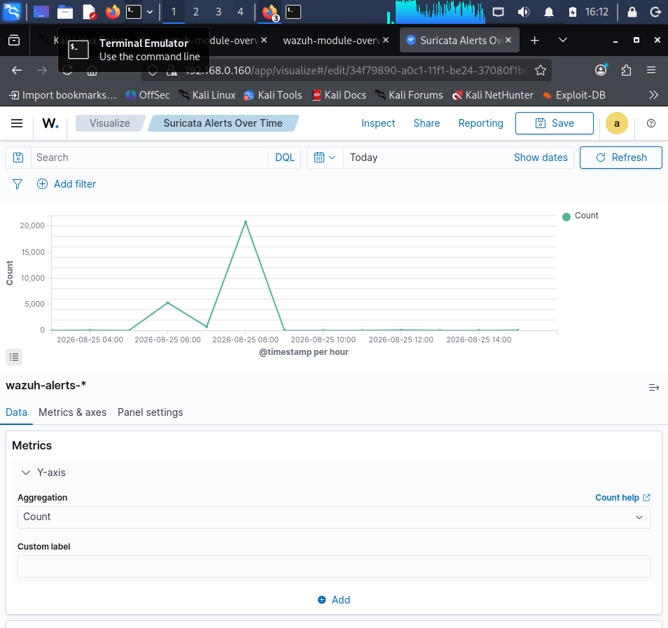


## 12. Evidence and Screenshots

Screenshots were captured throughout the implementation to provide evidence of the configuration, monitoring and results.

The screenshots include evidence relating to:

* Suricata installation and version verification.
* Suricata configuration testing.
* Suricata rules.
* Suricata monitoring.
* Wazuh Manager status.
* Suricata events received by Wazuh.
* Wazuh Active Response configuration.
* Wazuh Dashboard monitoring.
* Suricata alert visualization.

The latest visualization evidence was captured as:

```text
20-Suricata-Alerts-Over-Time.png
```

The remaining screenshots are stored in the project's `screenshots` directory.

## 13. Troubleshooting

During the implementation, several configuration and environment issues were encountered.

The Wazuh environment produced an error relating to JSON decoding:

```text
wazuh-analysisd: ERROR: Too many fields for JSON decoder
```

The Wazuh Manager was subsequently restored and confirmed to be active.

The VirtualBox environment also experienced clipboard issues between the host system and the virtual machines. VirtualBox Guest Additions and clipboard settings were checked, and the virtual machines were restarted. After restarting the environment, clipboard functionality was restored.

Connectivity between the virtual machines was also verified using network connectivity tests. Successful ping responses confirmed communication between the systems.

## 14. Results

The implementation successfully demonstrated the integration of Suricata with Wazuh.

The following results were achieved:

1. Suricata was installed and configured.
2. Suricata configuration was tested successfully.
3. Suricata rules were loaded for network traffic detection.
4. Suricata was run as an active monitoring service.
5. Suricata generated security events.
6. Suricata EVE JSON events were monitored by Wazuh.
7. Suricata alerts were visible in Wazuh.
8. Wazuh Active Response was configured using `firewall-drop`.
9. The Wazuh Manager remained active after configuration.
10. Suricata alerts were displayed through the Wazuh Dashboard.
11. A line visualization showing alert counts over time was created.

## 15. Conclusion

This project demonstrated the implementation of a Network Intrusion Detection System using Suricata and Wazuh.

Suricata monitored network traffic and generated security alerts, while Wazuh provided centralized monitoring, alert analysis, dashboard visualization, Active Response, and firewall-based traffic blocking.

The integration demonstrated how an IDS can be combined with a security monitoring platform to improve visibility into network security events and provide a foundation for automated incident response.

## 16. Project Repository Structure

The project is organized as follows:

```text
CodeAlpha_NetworkIntrusionDetectionSystem/
│
├── documentation/
│   └── Task4-Report.md
│
├── logs/
│
├── screenshots/
│   ├── Task 4 evidence screenshots
│
├── .gitignore
├── README.md
└── setup.sh
```

## 17. Final Remarks

The completed implementation provides a practical demonstration of network intrusion detection, centralized security monitoring and Active Response using Suricata and Wazuh.

All configuration steps, observations, troubleshooting activities and visual evidence are documented in this repository.
